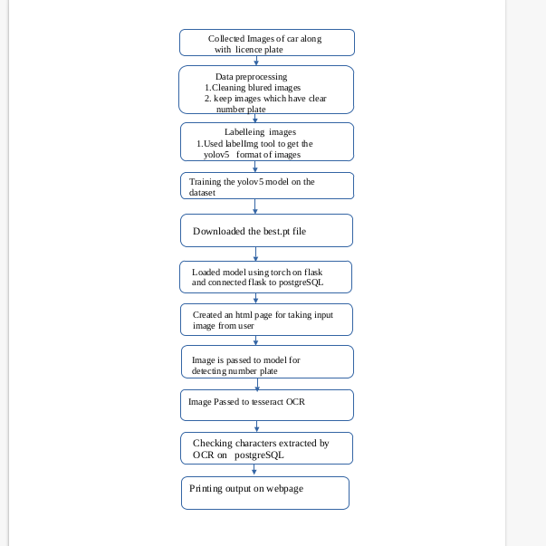

#                         Number Plate Authentication System

# Flow Chart

# Process 

# step1: Getting Dataset
   Downloaded some high quality car images with number plate and cleaned the images for clear number plate 

# step2: labelling images  for  YOLOV5 format:
   Labelled Images using LabelImg tool and got text files of each image

# step3: Training the YOLOV5
   Trained the YOLOV5  model on dataset  and downloaded the best.pt file 

# step4: Loading model on flask
   Loaded model on the flask using torch with the trained weights file

# step5:Connecting to Database
   Connected flask to postgreSQL using psycopg2 
# step6: Taking Input
   created an html page for taking input image from user for number plate extraction
# step7: Detection for number plate
   Called the model for number plate detection on input image and cropped image on bounding box co-orcinates

# step8: Tesseract 
   Passed the cropped image on tesseract and extracted the number plate details and done basic image processing on cropped image

# step9: checking on database
   Checking the number plate details on database and printing the output on webpage   
